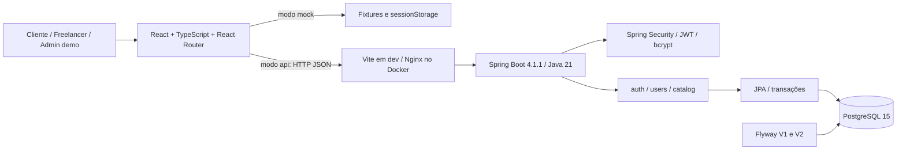

# Arquitetura dos sistemas

Monorepositório com dois aplicativos e um banco. A aplicação web é uma SPA React; o backend é um monólito Spring Boot modularizado por domínio. Uma única API atende clientes e freelancers. A administração real será incluída no mesmo backend após a etapa de demonstração.

| Camada | Local | Responsabilidade |
|---|---|---|
| Rotas e shell | `web/src/App.tsx`, `web/src/app/` | Layout, sessão, navegação e guards |
| Features | `web/src/features/` | Formulários e fluxos por área |
| Dados web | `web/src/data/client.ts` | Seleção explícita mock/API e chamadas HTTP |
| Domínio web | `web/src/domain/` | Tipos e regras testáveis do fluxo simulado |
| Controllers/DTOs | `api/.../{auth,users,catalog}` | HTTP, validação, representação pública/privada |
| Services | Mesmos módulos | Regras de negócio e fronteiras transacionais |
| Repositories/entidades | Mesmos módulos | Persistência, busca e vínculos |
| Config/common | `api/.../{config,common}` | Segurança, CORS, seed e Problem Details |
| Banco | `api/src/main/resources/db/migration/` | Esquema evolutivo versionado |

JWT HS256 é emitido pelo próprio backend com issuer validado, expiração de 900s e segredo configurado por ambiente com pelo menos 32 bytes. Cada requisição autenticada verifica também que a conta existe e está ativa. O frontend guarda a sessão em `sessionStorage`, conserva a expiração absoluta após reload e elimina a sessão ao expirar. Uma fase futura deve avaliar cookies HttpOnly/CSRF ou outra política de sessão adequada à implantação pública.

Os dados privados aparecem em `/users/me`; os perfis de catálogo são DTOs sem contatos. Não se serializam entidades JPA diretamente. O serviço de catálogo usa lock no usuário para evitar que duas publicações simultâneas ultrapassem o limite de anúncios ativos.

Flyway controla o esquema e JPA executa `validate`; não usar `ddl-auto=update`. Categorias fazem parte das migrações. Usuários/anúncios fictícios são seed de desenvolvimento separado, desativado por padrão fora do Compose local.

## Ambiente local

| Serviço | Porta no host | Porta interna | Observação |
|---|---|---|---|
| Web | 5173 | 80 no Nginx | SPA fallback e proxy `/api` |
| API | 8081 | 8081 | Health em `/actuator/health` |
| PostgreSQL | 5435 | 5432 | Volume nomeado `postgres_data` |
| Banco de teste | Não publicado | 5432 | Isolado, armazenamento temporário |
| Vite dos testes | 5174 | 5174 | Servidor automático do Playwright |

Compose publica as portas em `127.0.0.1`. Não é uma infraestrutura de produção. Credenciais da `.env.example` são deliberadamente locais; produção requer configuração própria, TLS, migração controlada, backup/restauração e observabilidade.

## Sistemas futuros

| Sistema | Vínculo planejado | Dependência |
|---|---|---|
| Contratação/reputação | Usuários e anúncios + snapshots contratuais | UC03/UC04/UC06 implementados na API |
| Administração/auditoria | Usuários, categorias, denúncias, disputas | Provisionar admin e autorização auditada |
| Mensagens/notificações | Participantes da contratação, eventos | Persistência + serviço SMTP; decidir realtime |
| Arquivos | Fotos de serviço/perfil e anexos de disputa | Política de imagens, storage e limites |
| Financeiro | Contratação + transações e saldo conciliado | Escolher gateway e validar regras comerciais |

Nenhum fornecedor externo foi contratado, e nenhum e-mail/mensagem foi enviado por esta base. Organização visual e README não constituem validação dos requisitos operacionais do produto.
