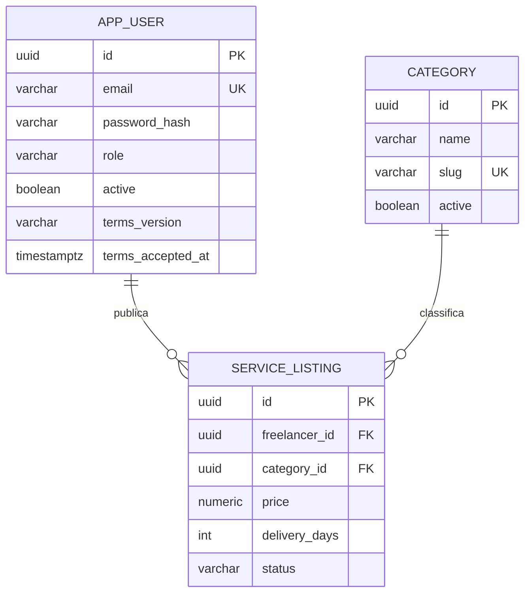

# Modelo de dados

Esquema implementado na migração `V1__initial_schema.sql`; categorias iniciais em `V2__categories.sql`.

| Tabela | Campos e limites principais | Regras |
|---|---|---|
| `app_user` | UUID; nome 100; e-mail 254 único; hash; telefone 20; role; ativo; cidade 100; bio 600; termos/aceite; criação | E-mail em minúsculas; `CLIENT`, `FREELANCER`, `ADMIN`; hash bcrypt |
| `category` | UUID; nome; slug único; ativo | Migração cria Elétrica, Encanamento, Limpeza, TI e Pintura |
| `service_listing` | UUID; dono/categoria FK; título 80; descrição 500; preço `numeric(12,2)`; dias; status; criação | Preço >0; dias 1–365; `DRAFT`, `ACTIVE`, `INACTIVE`; dono validado pelo serviço |

Índices apoiam consulta por proprietário/status e categoria/preço em anúncios ativos. Integridade referencial mantém vínculos; desativação não elimina histórico. O limite de 20 ativos é regra transacional, não um simples `CHECK` de linha.

Valores monetários trafegam como número JSON e são `BigDecimal` no Java; o banco não usa ponto flutuante para preço. No mock, o JavaScript representa valores ilustrativos; isso não é base de contabilização financeira.

## Próximas migrações propostas

Não criar todas as tabelas agora sem validar o contrato da respectiva feature. Felipe coordena migrações e Caio/Arthur revisam os vínculos com autenticação e telas.

| Entidade futura | Vínculos e invariantes |
|---|---|
| `contract` | Cliente, freelancer, serviço; snapshot de título/escopo/preço; data futura; estado; uma pendência por cliente/serviço |
| `contract_event` | Contratação, ator, estado anterior/novo e timestamp; histórico imutável |
| `review` | Contratação única e concluída; nota 1–5; autor; texto 500; resposta 200; janela de 7 dias |
| `demand` / `proposal` | Cliente/categoria e freelancer; orçamento, prazo, estado; uma proposta pendente por profissional/demanda |
| `report` / `dispute` / `audit_event` | Alvo, autor, evidência, decisão e administrador; preservar rastreabilidade |
| `message` / `notification` | Participantes autorizados e eventos; status de leitura/entrega |
| `service_image` | Dono, storage key, tipo/tamanho, ordem e metadados; máximo 5 |
| `payment` / `ledger_entry` | Referência gateway única, contratação, eventos idempotentes, valores e conciliação |

O seed `DemoData` cria dados fictícios no perfil `dev` quando habilitado; não há seed financeiro nem admin real. Testes de API geram identificadores/e-mails novos, sem assumir IDs dos usuários do seed.
