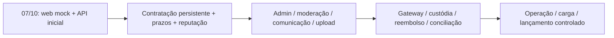

# Roadmap

Planejamento iniciado em **30/09/2026**, com entrega em **07/10/2026 (quarta-feira)**. Horários de Brasília. O foco da semana é estabilizar a base React mock + API inicial e preparar uma demonstração reproduzível. A entrega web foi confirmada pelo líder.

| Data | Marco e trabalho | Responsáveis | Saída verificável |
|---|---|---|---|
| Qua 30/09 | Ler fontes, organizar docs, scaffolds, banco, auth/catalog e frontend mock | Base inicial preparada | Repositório organizado, aplicação e testes executáveis |
| Qui 01/10 | Confirmar responsáveis e imagens; revisar contratos e instruções de execução | Líder + todos | Cada integrante executa o projeto e abre seus cards |
| Sex 02/10 | Fechar revisão de auth/perfis/catálogo e estados das telas principais | Caio, Felipe, Arthur Almirante, Arthur | Primeiro ciclo de PRs revisados; mock/API consistentes |
| Sáb 03/10 / Dom 04/10 | Folga de planejamento; ajustes opcionais conforme disponibilidade | Quem puder | Nenhum trabalho crítico depende do fim de semana |
| Seg 05/10 | Integração do grupo; fluxo de contratação, admin e regressões | Todos; Enzo coordena QA | Branch integrada sem bloqueios P0 |
| Ter 06/10 até 17h | Corrigir P0, verificar clone novo, ensaiar e congelar escopo | Líder + Enzo + responsáveis | CI verde, roteiro e evidências; versão candidata |
| Qua 07/10 | Revisão final e apresentação; somente correções bloqueantes | Líder + todos | Web mock completo navegável; API real e banco demonstrados |

Se o horário da apresentação for definido pela instituição, o líder ajusta a janela do último dia. Não há horário de apresentação inventado neste plano.

## Critérios do marco

- Fluxo mock: buscar, solicitar, aceitar, iniciar, sinalizar, confirmar/contestar e avaliar com atores corretos.
- Fluxo API: cadastro, login, perfil e anúncio persistidos; registro continua após reload; permissões e dados privados verificados.
- Administração/financeiro/comunicação apresentados como simulação, sem prometer integração inexistente.
- Nenhum bloqueio P0 de navegação, formulários ou execução; funcionamento em 390 px e desktop.
- Código, documentação, tarefas, variáveis de exemplo e testes compartilháveis via Git.

## Fases posteriores

O roadmap antigo em `legado/` continua disponível como referência. Suas 18 etapas foram condensadas aqui sem carregar Vue/admin separado ou aplicativo móvel para a entrega atual. Fases seguintes dependem dos cards F01–F10 e serão datadas após a apresentação.

## Riscos concretos e ação

| Risco | Resposta |
|---|---|
| Nomes de arquivos/tipos compartilhados gerarem conflitos | Coordenar edição e integrar PRs pequenos diariamente |
| Competências/disponibilidade ainda desconhecidas | Confirmar em 01/10 e reequilibrar W06/Q04 se necessário |
| Imagens não escolhidas | Entregar ícones/iniciais já implementados; imagens não bloqueiam o fluxo |
| Confundir mock com integração real | Modo explícito, avisos e demonstrações separadas |
| Ampliar financeiro/chat durante a semana | Manter escopo; novas integrações entram no backlog futuro |
| Problema de ambiente em outro computador | Clone novo, Compose e teste do README antes do congelamento |

O líder decide corte de P1 se os testes P0 falharem. Não reduzir autorização, validações ou rotulagem das simulações para cumprir prazo.
