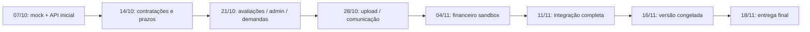

# Roadmap — entrega final em 18 de novembro de 2026

Planejamento iniciado em **30/09/2026**. **Prazo final informado pelo líder: 18/11/2026, quarta-feira.** Todas as datas intermediárias abaixo são exemplos sugeridos para organizar o trabalho; o grupo pode ajustar a distribuição respeitando o prazo final. Horários de Brasília.

O marco de **07/10** continua sendo a primeira entrega: React web completo em modo mock e API inicial com banco, cadastro, login, perfis e catálogo. De **08/10 a 11/11**, o plano integra as demais funcionalidades. De **12/11 a 18/11**, a equipe concentra testes, correções, documentação e apresentação. Aplicativo móvel permanece fora do escopo confirmado.

## Calendário geral sugerido

| Período | Entrega da etapa | Responsáveis propostos | Critério para encerrar |
|---|---|---|---|
| 30/09–07/10 | Base do projeto, documentação, React mock e API inicial | Todos; líder coordena | Frontend navegável; cadastro, login, perfil e anúncio persistidos; CI verde |
| 08–14/10 | Contratações reais, histórico e rotinas de prazo — F01/F02 | Felipe + Arthur; Enzo testa | Cliente solicita; freelancer aceita/inicia/sinaliza; cliente confirma/contesta; estados salvos no banco |
| 15–21/10 | Avaliações, administração, moderação e demandas/propostas — F03/F04/F05/F08 | Caio + Felipe no backend; Arthur + Arthur Almirante no web; Enzo revisa | Nota/avaliação persistente; admin autorizado; denúncia/disputa e proposta com fluxo integrado |
| 22–28/10 | Imagens, busca paginada, mensagens, notificações e e-mail — F06/F07 | Caio + Felipe no backend; Arthur + Arthur Almirante no web; Enzo testa | Upload validado; busca usa paginação da API; comunicação persistente entre contas; recuperação de acesso funciona |
| 29/10–04/11 | Financeiro integrado em sandbox — F09 | Felipe + Caio; Arthur Almirante integra telas; líder fecha regras | Pagamento de teste, custódia/repasse representados no sistema, webhook idempotente, reembolso e conciliação testados |
| 05–11/11 | Integração completa, ambiente de demonstração e operação — F10 | Todos; líder + Enzo coordenam | Fluxos completos sem dependência de fixtures, ambiente reproduzível, backup/restauração e testes de acesso/carga executados |
| 12–16/11 | Regressão, correções e fechamento da documentação | Enzo + donos das funcionalidades; líder integra | Sem bloqueios de entrega; documentação corresponde à versão; congelamento em 16/11 |
| 17/11 | Ensaio geral e conferência dos arquivos finais | Todos | Apresentação executada do início ao fim; versão e instruções de execução conferidas |
| **18/11** | **Entrega final do projeto** | **Líder + todos** | **Sistema web integrado, código, documentação, evidências e apresentação entregues** |

Essas funcionalidades ainda precisam ser implementadas e revisadas; colocar uma data no plano não altera seu estado atual. Os pares propostos seguem as áreas da [equipe](equipe.md) e devem ser confirmados conforme experiência e disponibilidade.

## Primeira etapa — até 7 de outubro

| Data sugerida | Trabalho | Saída verificável |
|---|---|---|
| Qua 30/09 | Leitura das fontes, organização dos docs, scaffolds, banco e base React/API | Base inicial já preparada; materiais originais preservados |
| Qui 01/10 | Confirmar responsáveis e imagens; revisar contratos e execução local | Cada integrante executa o projeto e conhece seus cards |
| Sex 02/10 | Revisar auth/perfis/catálogo e telas principais | Primeiro ciclo de PRs revisados; mock/API consistentes |
| 03–04/10 | Ajustes opcionais conforme disponibilidade | Trabalho crítico não depende do fim de semana |
| Seg 05/10 | Integrar o trabalho do grupo e percorrer contratação/admin mock | Branch integrada sem bloqueios do marco inicial |
| Ter 06/10 | Corrigir bloqueios, conferir clone novo e ensaiar | Versão candidata e roteiro; corte às 17h é uma sugestão |
| **Qua 07/10** | **Demonstrar frontend mock e API inicial** | **Primeiro marco concluído; restante segue no calendário até 18/11** |

## Datas de controle por etapa

| Data sugerida | Decisão ou revisão | Dependência que resolve |
|---|---|---|
| 09/10 | Definir gateway de testes, comissão, regras financeiras, storage/e-mail e ambiente de demonstração | Permite preparar integrações externas sem esperar a semana financeira |
| 14/10 | Demonstrar ciclo de contratação com duas contas e persistência após reload | Base para avaliações, disputas e financeiro |
| 21/10 | Demonstrar nota, proposta aceita e decisão administrativa com autorização | Fecha regras de reputação, administração e demanda |
| 28/10 | Demonstrar upload, comunicação entre contas e recuperação de senha | Fecha catálogo/comunicação; prepara regressão completa |
| 04/11 | Demonstrar pagamento e reembolso de teste com eventos repetidos | Confere financeiro e idempotência antes do fechamento |
| 11/11 | Concluir funcionalidades e conferir integração em ambiente de demonstração | Abre a reserva final de correções |
| **16/11** | **Congelar a versão de entrega** | **Novas funcionalidades deixam de entrar; corrigir apenas bloqueios** |
| **17/11** | **Ensaiar e conferir material final** | **Evita depender de ajustes na data de entrega** |
| **18/11** | **Entregar** | **Prazo final fixado pelo líder** |

O financeiro deve ser demonstrado no **ambiente de testes do gateway**, incluindo os fluxos previstos de pagamento, status, reembolso e conciliação. Habilitação de cobranças reais em produção depende do fornecedor e das condições comerciais; não é tratada como concluída pela entrega acadêmica. Nenhum fornecedor foi escolhido ou contratado por este planejamento.

## Critérios da entrega final

- React web responsivo com os fluxos previstos de cliente, freelancer e administrador integrados à API.
- Cadastro, login, perfis, anúncios, contratações, avaliações, demandas, propostas, denúncias/disputas, mensagens e notificações persistidos e autorizados por perfil/participação.
- Upload, paginação, e-mail e rotinas de prazo verificados; pagamentos testados em sandbox com tratamento de eventos repetidos e conciliação.
- Testes de fluxo e cenários negativos passando; nenhum bloqueio de navegação, formulário, autorização ou execução.
- Banco com migrações, dados de demonstração controlados, instruções de execução e backup/restauração conferidos.
- README, arquitetura, requisitos, API, banco, roteiro e evidências correspondentes à versão final; código disponível no Git.
- Apresentação ensaiada e materiais prontos até 17/11. Horário da apresentação/entrega em 18/11 ainda será informado pelo líder.

## Sequência de marcos

O roadmap antigo em `legado/` permanece como referência histórica. Os cards **F01–F10** do [backlog](backlog.md) agora têm janelas de execução até novembro; as etapas deixaram de ficar sem data.

## Acompanhamento e reserva

Revisar o progresso em cada data de controle. O líder acompanha PRs e dependências; Enzo coordena a regressão; cada dono demonstra seu fluxo com frontend e backend juntos. Registrar atrasos e replanejar o trabalho entre os integrantes antes do próximo marco.

| Risco | Ação no planejamento |
|---|---|
| Disponibilidade ou conhecimentos dos colegas ainda não confirmados | Validar responsáveis em 01/10 e ajustar carga semanal |
| Conflitos em tipos, adapter, store, rotas e CSS compartilhados | Combinar edição e integrar PRs pequenos durante a semana |
| Gateway/storage/e-mail escolhidos tarde | Resolver fornecedores e credenciais de teste até 09/10 |
| Acumular integração para a última semana | Exigir demonstração integrada em cada marco semanal |
| Confundir mock com funcionalidade entregue | Fechar F01–F10 apenas após persistência/integração e aceite |
| Falhas descobertas perto do prazo | Reservar 12–16/11 para regressão e manter 17/11 para ensaio |

As datas sugeridas não pressupõem trabalho obrigatório em fins de semana. A disponibilidade real do grupo deve orientar a distribuição dentro de cada janela, preservando **18/11/2026** como prazo final.
